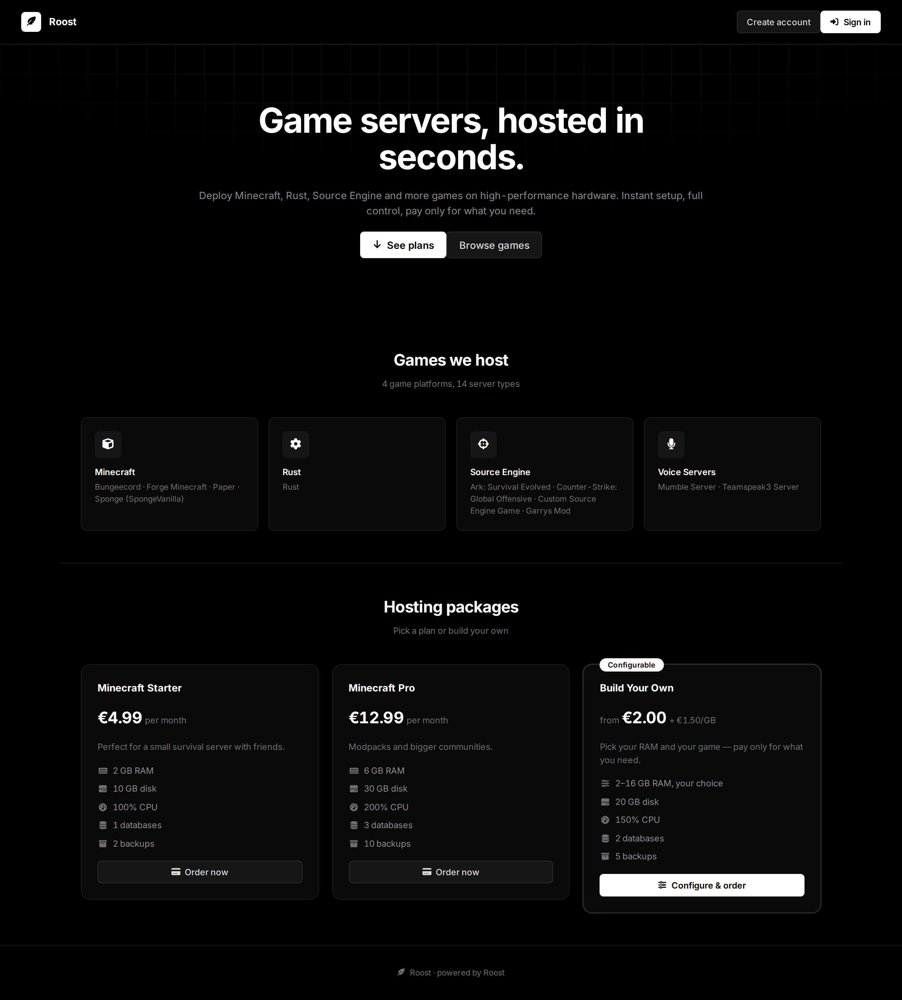
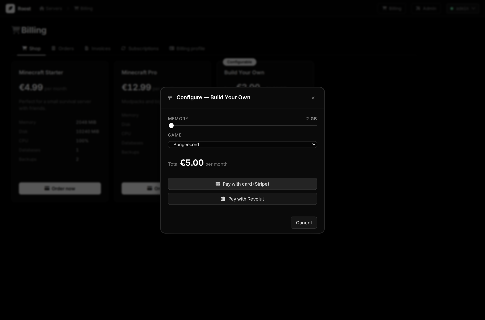
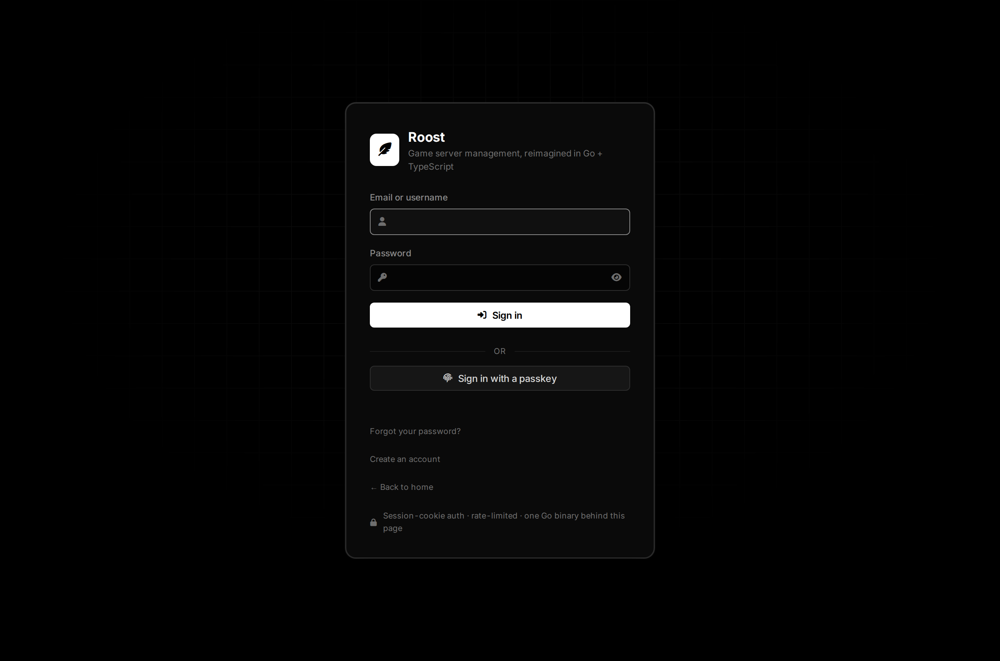
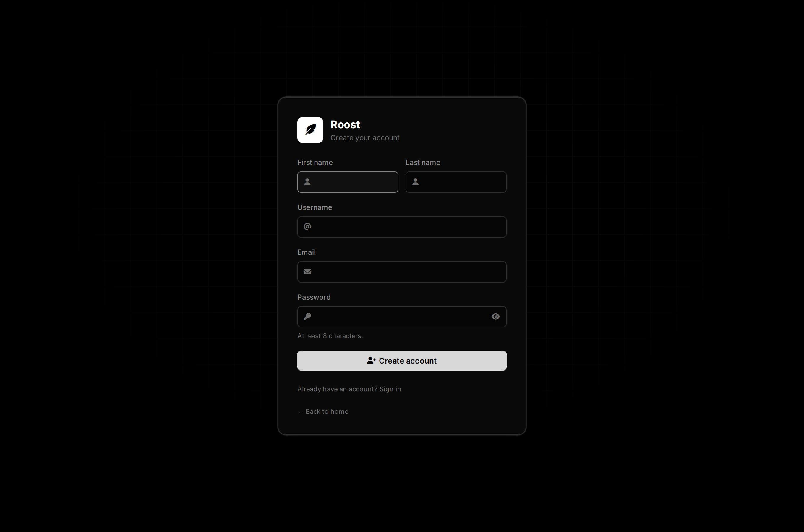
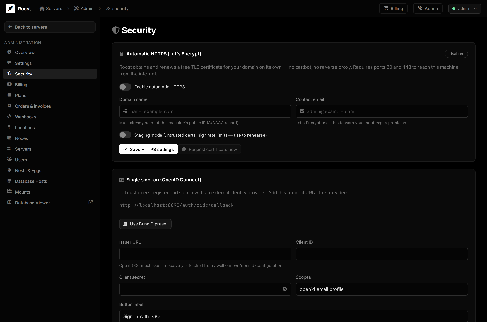
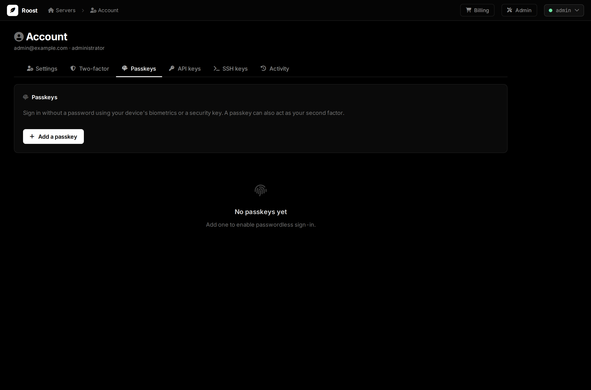

# Roost

**Roost** — where your servers come home to. A ground-up **Go + TypeScript**
successor to [Pterodactyl](https://github.com/pterodactyl/panel),
[Pelican](https://github.com/pelican-dev/panel) and
[Pyrodactyl](https://github.com/pyrohost/pyrodactyl): one static binary, one
SQLite file, zero PHP. Wings-compatible, so existing daemons, eggs, billing
panels and API integrations keep working — the wings fly back to a new roost.

Design system shared with GoTypeMyAdmin: true-OLED black canvas, strict
grayscale ramp, Inter / JetBrains Mono, Font Awesome, and a hand-built
component library — no frontend framework at all.

```
┌────────────────────────────────────────────────────────────────┐
│ 🪶 Roost     Servers › f287221c › console        Admin  admin ▾ │
├──────────────┬─────────────────────────────────────────────────┤
│ ← SMP        │  ● SMP running               ▶ ↻ ■ ☠            │
│ ▸ Console    │  ┌ CPU 42% ┐┌ RAM 1.2G ┐┌ Disk 3.1G ┐┌ Up 2h ┐  │
│   Files      │  ┌───────────────────────────────────────────┐  │
│   Databases  │  │ [12:01:33 INFO] Done (3.216s)! For help…  │  │
│   Schedules  │  │ > _                                       │  │
│   …          │  └───────────────────────────────────────────┘  │
└──────────────┴─────────────────────────────────────────────────┘
```

## Screenshots

Public storefront — games catalogue and hosting packages, with a "build your
own" configurable plan (customer picks RAM + game, priced live):



The configurator: RAM slider + game picker with a live quote, straight into
Stripe/Revolut checkout.



Passwordless sign-in (passkeys) and public self-registration:

 

Admin — external identity (OpenID Connect) with a one-click **BundID** preset,
and per-account passkey management:

 

## Why another panel?

| | Pterodactyl | Pelican | Pyrodactyl | **Roost** |
|---|---|---|---|---|
| Runtime | PHP + MySQL + Redis + queue worker + nginx | PHP (SQLite ok) | PHP + MySQL + Redis | **one Go binary** |
| Storage | MySQL | MySQL/SQLite/Postgres | MySQL | **SQLite (WAL), single file** |
| Frontend | React (webpack) | Filament/Livewire | React (Vite) | **hand-built TS, ~25 KB gz JS** |
| Wings compatible | ✓ | ✓ | ✓ | **✓** (client/application/remote APIs) |
| Webhooks | ✗ | ✓ | ✗ | **✓** (any event, prefix filters) |
| Egg import by URL | ✗ | ✓ | ✗ | **✓** (PTDL v1 + v2) |
| Built-in database viewer | ✗ | ✗ | ✗ | **✓** (full phpMyAdmin replacement) |
| HTTPS | reverse proxy + certbot | reverse proxy + certbot | reverse proxy + certbot | **✓ built-in Let's Encrypt, auto-renewing** |
| Payments & billing | ✗ | ✗ | ✗ | **✓ Stripe + Revolut, auto-provisioning, EU-compliant invoices** |
| Login protection | reCAPTCHA | Turnstile | captcha | **rate limiting + Turnstile / reCAPTCHA / hCaptcha, stackable, visible or invisible w/ browser-check gate** |
| Install | multi-service | installer | multi-service | **`./roost` — done** |

## Quick start

```sh
make            # builds frontend + embeds it + builds ./roost
./backend/roost -db roost.db -addr :8090 -url https://panel.example.com
```

First boot seeds the default nests/eggs (Minecraft, Rust, Source, Voice),
prints the admin credentials, and provisions a **`local` location + `local`
node** for the machine the panel runs on (127.0.0.1, ports 25565–25580) — so
a fresh install can create a server immediately.

### Pairing a Wings node

1. Admin → Nodes → `local` → *Wings config* → copy onto the machine as
   `/etc/pterodactyl/config.yml`, then start wings.
2. Create a server — wings picks it up via `/api/remote`.

For a remote machine, add a Location and Node first, then its allocations.

## Architecture

```
roost/
├── backend/                Go 1.26, stdlib net/http mux
│   ├── main.go             flags, boot, graceful shutdown
│   ├── internal/store/     SQLite schema + queries (modernc, pure Go)
│   ├── internal/auth/      bcrypt, TOTP, HS256 JWTs, tokens
│   ├── internal/api/       client + application + remote APIs, scheduler,
│   │                       webhooks, rate limiting
│   ├── internal/wings/     daemon client + browser-facing signed URLs
│   ├── internal/billing/   VAT rules + Stripe & Revolut checkout/webhooks
│   ├── internal/dbviewer/  vendored GoTypeMyAdmin API (MySQL/MariaDB)
│   ├── internal/seed/      embedded PTDL egg exports, first-boot admin + node
│   └── web/                embedded SPA (go:embed)
├── dbviewer-frontend/      vendored GoTypeMyAdmin SPA (served at /dbviewer/)
└── frontend/               Vite + TS, no framework
    ├── src/core/           signals, el() hyperscript, popover layer
    ├── src/components/     Button, Modal, Menu, DataGrid, Toast, …
    └── src/views/          Login, Dashboard, Server (console/files/…),
                            Account, Admin (nodes/eggs/webhooks/…)
```

- **API compatibility** — endpoints, envelopes (`{object, attributes}`),
  permission names and the wings JWT/websocket protocol mirror Pterodactyl
  1.x, with `ptlc_`/`ptla_` API keys.
- **Console** — the browser talks straight to wings' websocket with a
  panel-signed JWT; the panel proxies file operations so only signed
  download/upload URLs bypass it.
- **Schedules** — a built-in cron evaluator runs command/power/backup tasks;
  no external queue worker.
- **Webhooks** — every activity event can be POSTed to configured endpoints
  (`Admin → Webhooks`), with event-prefix filters.
- **Billing & payments** — `Admin → Billing` turns the panel into a shop:
  define plans (a price plus a server spec), and when a customer pays via
  **Stripe** or **Revolut Business** the server is provisioned automatically
  and an invoice is issued. Webhook signatures are verified (HMAC, replay
  window); recurring subscriptions suspend/resume the server on
  cancellation/renewal. Invoices are **EU-compliant**: gapless per-year
  sequential numbers, seller & buyer identities with VAT ids, a net/VAT/gross
  breakdown, and automatic **reverse charge** for EU B2B customers with a valid
  VAT id. Money is stored in integer minor units — no float rounding touches a
  total. Provider secrets are write-only and never returned to the browser.
- **Automatic HTTPS** — `Admin → Security` takes a domain and a contact
  email and Roost obtains + renews a Let's Encrypt certificate itself
  (`autocert`, HTTP-01). No certbot, no nginx. It serves ACME challenges on
  `:80`, TLS on `:443` (`-https-addr`), caches certs in `-acme-cache`, and
  pins `app:url` to `https://<domain>` so wings gets the right address. A
  staging toggle lets you rehearse without burning rate limits. Binding the
  privileged ports needs root or
  `setcap cap_net_bind_service=+ep ./roost`.
- **Database viewer** — GoTypeMyAdmin is vendored in and served at
  `/dbviewer/`, behind root-admin auth: browse/edit rows, run SQL, manage
  users and export dumps on any MySQL/MariaDB host, without deploying
  phpMyAdmin alongside the panel. Restrict reachable hosts with
  `-dbviewer-allow-hosts`.
- **CAPTCHA layers** — `Admin → Security` enables any combination of
  Cloudflare Turnstile, Google reCAPTCHA v2 and hCaptcha; all enabled layers
  must be solved on sign-in (they share one siteverify-style verifier, so
  adding providers is a two-line change). Each layer runs **visible**
  (classic widget) or **invisible**: invisible layers execute behind a
  Cloudflare-style "checking your browser" gate shown before the login form,
  and only escalate to an interactive challenge for suspicious clients.

## Development

```sh
cd backend  && go run . -db dev.db          # API on :8090
cd frontend && npm run dev                  # Vite on :5173, proxies /api + /auth
```

## Testing

```sh
make test           # everything below
make test-go        # Go unit + HTTP integration tests, with -race
make test-frontend  # vitest (reactive core, router, API client)
make test-e2e       # Playwright drives the real binary in a browser
make check          # go vet + tsc --noEmit
```

- **Go** (`backend/internal/**/*_test.go`) — bcrypt/TOTP (against the RFC 6238
  vectors) and JWT signing; every store constraint and cascade; the whole HTTP
  surface end-to-end through `httptest`, including auth, API-key scoping,
  subuser permissions, the wings remote protocol, SFTP auth, the cron engine,
  CAPTCHA and TLS validation, the database-viewer gate, and the whole billing
  flow (VAT/reverse-charge maths, Stripe & Revolut webhook signature
  verification, and the webhook → auto-provision → gapless-invoice path). A fake
  wings daemon covers the daemon client, and every bundled egg is parsed.
- **Frontend** (`*.test.ts`) — the signal/effect core (including dependency
  re-collection and nested effects), hash routing, and the API client.
- **End-to-end** (`e2e/`) — boots the built binary against a throwaway database
  and drives Chromium: login, admin area, the new-server flow, the database
  viewer gate, and the security surface.

Coverage (`-coverpkg` combined, **whole codebase including the vendored
viewer**): **85%**. Per package: `tlsmgr` 96%, `store` 95%, `wings` 93%,
`auth`/`session` 91%, `billing` 88%, `dbviewer/db` 86%, `api` 81%,
`dbviewer/api` 80%, `seed` 78%. Every request handler, store query, VAT/invoice path,
payment-webhook branch and database-error branch is exercised; the database
viewer is covered against a real MariaDB. The residual is a handful of
genuinely unreachable branches (e.g. `panic`-on-crypto-failure guards).

The database-viewer suite runs against a live MySQL/MariaDB. Locally,
`make test-dbviewer` brings up a container, runs the tests and tears it down;
CI provides a MariaDB service. Without one, those tests skip cleanly.
